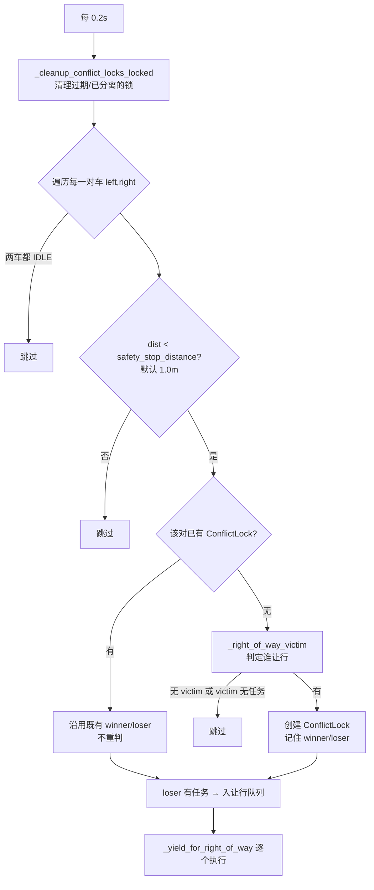
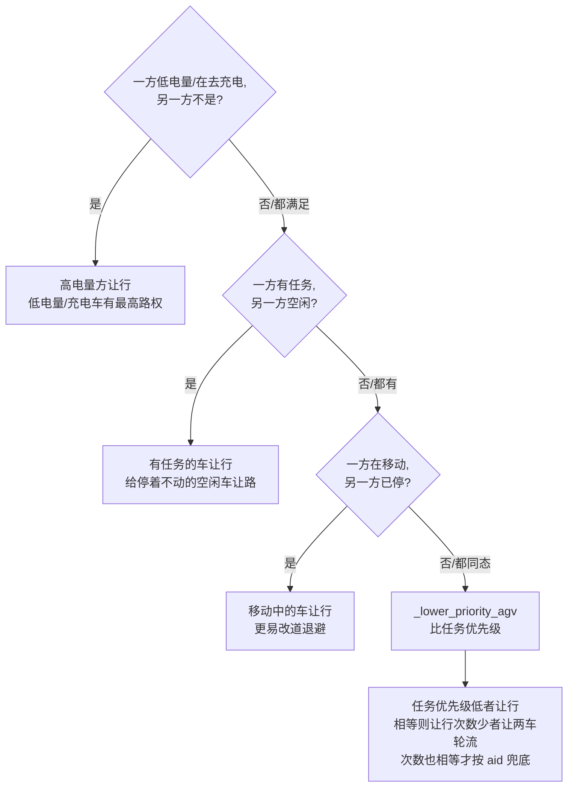
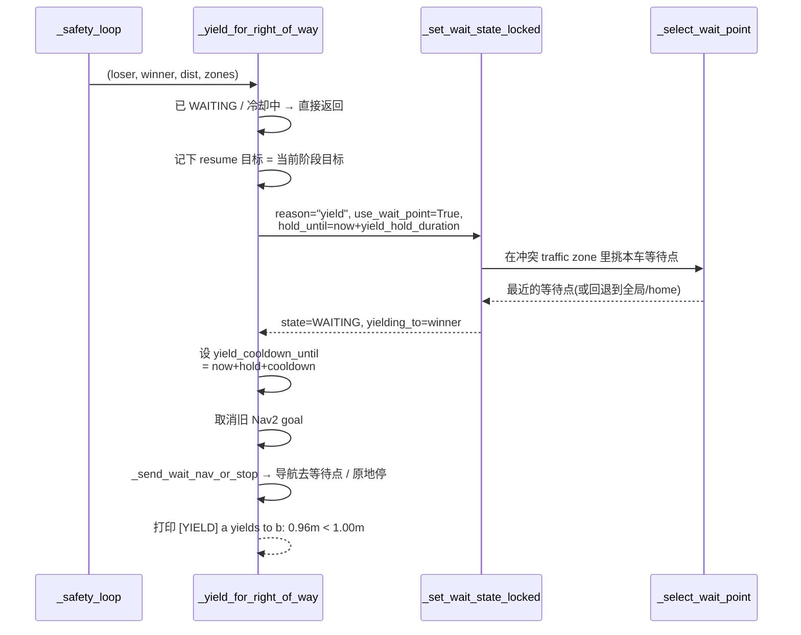
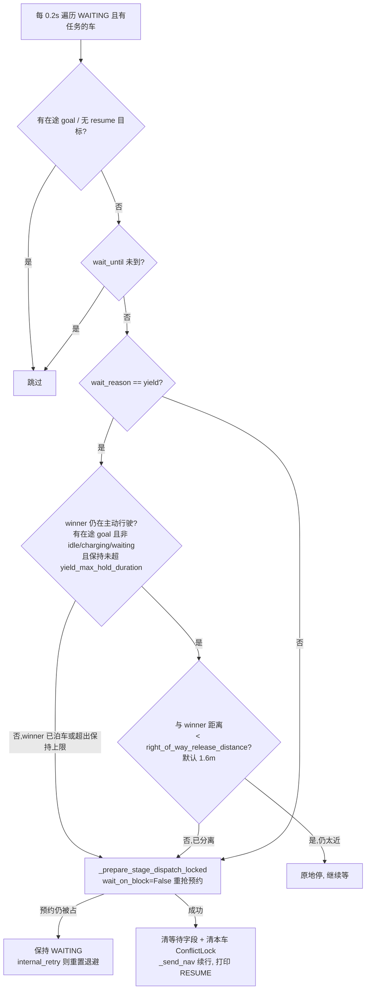

# AGV 调度器路权（Right-of-Way）设计说明

本文解释 `agv_scheduler/scheduler_node.py` 里**路权 / 让行**逻辑的设计：它要解决
什么问题、和预约系统是什么关系、谁让谁、怎么让、何时恢复，以及为防活锁/防抖/
保活（liveness）做了哪些约束。所有方法名、字段名都对应源码，便于对照阅读。

> **最近更新**：本说明已同步以下路权改动——① 抵达等待点后释放走廊预约改用可标定的
> `wait_release_tolerance`（§5）；② 让行败者**永不永久滞留 WAITING**：winner 泊车或超
> 保持上限即续行（§6）；③ 等优先级**公平轮流让行**而非固定让行者（§4）；并补充了与
> 停滞看门狗、电量单一数据源的关系（§11）。
>
> 注意：正文里出现的"修复 #2 / #3"指的是更早一轮的**评审 Bug 编号**（退避到等待点、
> 等待点导航可达），与上面这组改动是两套独立编号，勿混淆。
>
> 📐 完整的"路径冲突 → 让行 → 恢复"端到端流程图见可编辑的 draw.io / mxGraph XML：
> [`right_of_way_yield_flow.drawio`](right_of_way_yield_flow.drawio)（用
> [app.diagrams.net](https://app.diagrams.net) 或 VS Code 的 Draw.io 插件打开）。

---

## 1. 两层防撞模型：预约（主动） + 路权（被动安全网）

调度器对"两车撞上"这件事有**两道独立的防线**：

| 层 | 机制 | 何时介入 | 入口 |
| --- | --- | --- | --- |
| **第 1 层：路线预约**（主动、事前） | 每个执行阶段把途经的 `cell:` / `shelf:` / `dock:` / `traffic:` 资源**互斥预约**下来；拿不到就先等/原地停，**根本不发 Nav2 goal** | 派车、阶段切换之前 | `_reserve_stage_locked` / `_prepare_stage_dispatch_locked` |
| **第 2 层：路权让行**（被动、事后） | 两车**物理距离**逼近到安全阈值时，按优先级让其中一辆退避，腾出空间再续行 | 两车都在动、且 `dist < safety_stop_distance` | `_safety_loop` → `_yield_for_right_of_way` |

**为什么要两层。** 预约层用 2m 栅格做离散预约，能把"路径交叉"在发车前就串行化
（典型如 `cross` / `headon` 冲突场景：两车永远不会同时进独占走廊）。但栅格是离散
的、定位会漂、`queue` 型车道允许多车并存——总有"预约判不冲突、物理却贴得很近"
的残余情况。路权层就是这层**运行时安全网**（典型如 `stress` 强冲突场景：两车在非
独占 `station_queue` 里贴到 0.94m 触发实时让行）。

> 二者互补：绝大多数冲突在第 1 层就被串行化掉了；第 2 层只兜第 1 层漏过的近距离
> 残余冲突。

---

## 2. 相关数据结构与字段

```python
@dataclass
class ConflictLock:
    key: str            # _pair_key(a, b)，与左右顺序无关
    winner_agv: str     # 有路权、继续走的车
    loser_agv: str      # 让行、退避的车
    zones: Set[str]     # 冲突时两车共享的 traffic zone id
    created_at: float
```

`ConflictLock` 是路权逻辑的**记忆**：一旦为某一对车判定了 winner/loser，就把结论存
下来，**避免每个 tick 反复重判、两车互让**（见 §6 防活锁）。

`AGVState` 中与让行相关的字段：

| 字段 | 含义 |
| --- | --- |
| `state == WAITING` | 正在让行/等待预约（让行期间的统一状态） |
| `wait_reason` | `"yield"`（让行）/ `"reservation"`（预约被占）/ `"internal_retry"` |
| `yielding_to` | 让给了哪辆车（winner 的 aid），状态快照里可见 |
| `resume_state` / `resume_goal_xy` / `resume_goal_yaw` | 让行前的目标，解除后据此续行 |
| `wait_point_xy` | 退避到的安全等待点 |
| `wait_until` | 最短保持时间（`yield_hold_duration`）/ 重试退避截止；恢复时还据此算"超出意图保持多久"以触发保活上限 |
| `yield_cooldown_until` | 让行冷却截止：这之前不会被再次选为 loser，也不会再让 |
| `yield_count` | 该车累计让行次数，仅用作**公平让行**的平局键（§4，让得少的车这次让） |

定时器（`__init__` 中注册，均 5Hz）：

- `create_timer(0.2, self._safety_loop)` —— 检测逼近、触发让行；
- `create_timer(0.2, self._right_of_way_loop)` —— 判断并恢复已让行的车。

---

## 3. 触发流程：`_safety_loop`（5Hz）



要点：

- **先看是否已有锁**：已有就直接沿用既有 loser，不重新判定——这是防止两车互让的
  关键。
- 共享区 `shared_zones = _shared_traffic_zone_ids(left, right)`：取两车"已预约的
  traffic zone"∪"当前所在 traffic zone"的**交集**，用于挑退避等待点。
- 末尾还有一条独立安全兜底：任何"非 IDLE 但已无任务"的车一律 `_publish_stop`。

---

## 4. 谁让行：路权判定优先级（`_right_of_way_victim`）

返回**要让行的那辆车**（victim/loser）。先有两个**否决条件**：

1. 任一车已是 `WAITING` → 返回 `None`（已经在让/在等，不重复处理）；
2. 任一车处于让行冷却 `yield_cooldown_until > now` → 返回 `None`（刚让过，给它喘息，
   避免被反复拉去让行）。

否则按下面的**优先级阶梯**，自上而下第一个命中即决定：



设计意图：

- **低电量/充电优先**（`battery < battery_low_threshold` 或 `TO_CHARGE`）：电量是硬约
  束，快没电的车必须先走，对应 `_emergency_charge` 抢占的同一价值取向。
- **让给"动不了"的车**：空闲车没有目标、停在原地不会主动避让，所以让有任务、能
  重新规划的车去绕。
- **让给已停住的车**：已停的车可能在取货/已占位，移动中的车改道成本更低。
- **最终用任务优先级 + 公平让行兜底**收敛（`_lower_priority_agv`）：优先级低者让行；
  优先级相等时按**累计让行次数** `yield_count` 决定——**让得少的车这次让**，两车
  因此**轮流**而非固定一方永远当败者；只有让行次数也相等，才用 aid 做最后的确定性
  兜底（仍可复现）。早先"相等则 aid 较大者（如 `agv_02`）永远让"会让一辆车被持续
  压制，已被这条公平规则取代。

---

## 5. 怎么让行：退避到安全等待点（`_yield_for_right_of_way`）



- **退避点选择**（`_select_wait_point`）：优先选**冲突 traffic zone 内**为本车配置的
  等待点；没有则选任意区里本车的等待点；再没有就用全局 `wait_points`；多个候选取
  **离当前位置最近**的。在出厂布局里 `main_corridor` 给两车各配了等待点
  `(10.8, ±4.0)`。
- **退避 vs 原地停**（`_send_wait_nav_or_stop`）：已在等待点容差内就原地停；否则发一
  个去等待点的 Nav2 goal；发不出去就原地停。
- **抵达等待点即腾道**：让行车导航到等待点、到达后（与等待点距离 ≤
  `wait_release_tolerance`，默认 1.0m），在 `_nav_done` 的 `WAITING` 分支里**释放自己
  原来的走廊路线预约**，让 winner 能抢到这些格子通过。这个容差从早先硬编码的 1.0m
  改成了可标定参数，并**刻意 ≥ `wait_point_tolerance`**：等待点在走廊外、且仍有
  `_safety_loop` 兜底实时距离，因此宁可"早一点放走廊"也不要因为判得太严而把 winner
  困住（标定时对齐 Nav2 的 `xy_goal_tolerance` 与等待点几何）。
- 让行属于**真实任务阶段**，所以 `use_wait_point=True`（会退避腾道）。这正是评审
  Bug #2 恢复的行为；与之相对，内部移动（charge/return/manual）阻塞时是**原地等**
  （`_wait_should_hold_position`），因为它们的等待点就是目标点本身。
- 设 `yield_cooldown_until = now + yield_hold_duration + yield_cooldown_duration`，让行后
  这段时间内既不会被再选为 loser，也不会再发起让行；同时 `yield_count += 1`（每个让行
  回合只 +1，再次进入时因已是 `WAITING` 而提前返回），喂给 §4 的公平平局规则。

---

## 6. 何时恢复：`_right_of_way_loop`（5Hz）与防活锁



**四重防抖 + 一道保活兜底**（核心设计）：

1. **冲突锁记忆**：winner/loser 一旦判定就存进 `conflict_locks`，后续 tick 只沿用、
   不重判——杜绝"A 让 B、B 又让 A"的来回互让。
2. **让行冷却**（`yield_cooldown_until`）：让过的车在 `hold+cooldown` 秒内免于再次被选
   为 loser、也不再让行。
3. **释放距离迟滞**（hysteresis）：触发让行用 `safety_stop_distance`（1.0m），恢复要
   等到分离超过 `right_of_way_release_distance`（1.6m）。触发阈值 < 恢复阈值，留出
   缓冲带，避免在临界距离反复抖动。**注意**：这条迟滞**只在 winner 仍在主动行驶时**
   才拦住恢复；winner 一旦泊车就不再拦（见第 5 条）。
4. **最短保持时间**（`wait_until = now + yield_hold_duration`）：让行后至少保持一段时间
   才考虑恢复，给 winner 通过的时间窗。
5. **让行保活兜底**（liveness，关键修复）：恢复**不再只看距离**。winner 一旦**泊车**
   （`IDLE`/`CHARGING`/`WAITING`，或没有在途 Nav2 goal）就不会再压过来，loser **立即
   续行**；即便 winner 卡死不动，loser 被保持超过 `yield_max_hold_duration`（默认 30s）
   也**强制续行**。这杜绝了"winner 停在释放距离 1.6m 内不动 → 两车间距永不增大 →
   loser 永久卡在 `WAITING`"的死局。续行后实时安全仍由 `_safety_loop` 兜底：若再次贴
   近会重新触发让行。

**冲突锁清理**（`_cleanup_conflict_locks_locked`，每个 loop 开头跑）——满足任一即删除：
winner IDLE 且 loser 不在 WAITING / 两车已分离到 `≥ release_distance` / 锁过期
（`max(route_hold_timeout, hold+cooldown+5)`）/ 车不存在。

---

## 7. 参数（可调，`_declare_params` 默认值）

| 参数 | 默认 | 作用 |
| --- | --- | --- |
| `safety_stop_distance` | `1.0` m | 触发让行的逼近阈值 |
| `right_of_way_release_distance` | `1.6` m | 恢复/清锁的分离阈值（> 触发值形成迟滞） |
| `yield_hold_duration` | `2.0` s | 让行后最短保持时间 |
| `yield_cooldown_duration` | `3.0` s | 在保持时间之上额外的让行冷却 |
| `yield_max_hold_duration` | `30.0` s | 让行保持的**上限**：超出即强制续行（保活兜底，§6 第 5 条；`0` 关闭） |
| `wait_release_tolerance` | `1.0` m | 退避到等待点多近算"已腾出走廊"、可释放走廊预约（§5，刻意 ≥ `wait_point_tolerance`） |
| `battery_low_threshold` | `20.0` % | 低于此即获得"低电量最高路权" |

调参直觉：`release > stop` 决定迟滞带宽度；`hold + cooldown` 决定一辆车被反复让行的
最小间隔；调大可更稳但更慢，调小更激进但易抖。`yield_max_hold_duration` 是兜底上限，
正常远不该触到——它只在 winner 异常卡死时保证 loser 不被永久困住，设得远大于一次正
常通过的耗时即可。

---

## 8. 与状态快照 / 可观测性

`/agv/scheduler_status` 的 `fleet[aid]` 暴露 `state` / `wait_reason` / `yielding_to` /
`wait_point` / `resume_goal`，Web 控制面板据此把让行车高亮成 `⤳ <winner>`、把等待车
高亮成 `⏸ <reason>`，让路权过程肉眼可见。

---

## 9. 关键不变量

- 任一时刻，一对车至多存在一个 `ConflictLock`（`_pair_key` 与顺序无关）。
- 同一独占资源（exclusive `cell:` / `traffic:` / `dock:`）同一时刻至多一个预约持有者
  （第 1 层保证）；路权层不改这条，只处理物理逼近。
- 让行车进入 `WAITING` 后，其 `resume_state/resume_goal_*` 保存了让行前目标，恢复时
  原样续行，不丢任务。
- 让行触发（<1.0m）与恢复（≥1.6m）之间存在迟滞带，系统不会在临界距离震荡。
- **保活**：让行车不会永久滞留 `WAITING`——winner 一旦泊车就续行，最坏也在
  `yield_max_hold_duration` 内强制续行（§6 第 5 条）。
- **公平**：等优先级冲突的让行方随 `yield_count` 轮换，不存在永远固定的让行者（§4）。

---

## 10. worked example：强冲突场景实测时间线

`tools/control_panel.py` 的 **Strong conflict (live yield)** 场景把两车送向
`station_queue` 内 `(9,-1.5)` 与 `(9,1.5)`，实测：

```
t=0.0 [MANUAL] agv_02 waiting for reserved route ... via agv_01   # 第1层:预约串行
t=4.0 [RESUME] agv_02 resumes ...
t=5.8 [YIELD]  agv_02 yields to agv_01: 0.96m < 1.00m             # 第2层:实时让行触发
t=5.8 [WAIT]   agv_02 -> main_corridor:agv_02 for yield (agv_01)  # 退避到等待点(§5)
t=7.8 [RESUME] agv_02 resumes returning toward (9.0,1.5)          # 分离后恢复(§6)
final: 两车都到位 (9,-1.5) / (9,1.5)                               # 化解,无死锁无碰撞
```

`tools/verify_panel.py` 对该场景断言：**至少触发一次 `[YIELD]` 且最小间距 <
`safety_stop_distance`**，同时**两车最终都抵达目标**（路权确实化解了冲突）。

---

## 11. 边界与注意事项

- 两车都 `IDLE` 时 `_safety_loop` 直接跳过（停着不算冲突）。
- victim 必须**有任务**才会真正让行（`loser.task` 判空）——纯空闲车不会被赶走。
- 内部移动（charge/return/manual）阻塞时**原地等**而非退避（其等待点即目标，导航过去
  会绕过失败的预约），见 `_wait_should_hold_position`。
- 路权层依赖 pose 的物理距离，因此 pose 质量（`pose_source` / TF 新鲜度）会影响触发
  时机；预约层（第 1 层）不依赖实时 pose，是更可靠的主防线。
- **与停滞看门狗的关系**：持有走廊预约却**卡死无进展**的车（Nav2 停滞但 odom 仍新鲜）
  会被 `_nav_watchdog` 的停滞看门狗（`nav_stall_timeout`，默认 30s）判定、重排任务并
  **释放其预约格**，避免它无限自动续期把走廊资源占死、饿死他车。这与 §6 的让行保活
  是两条互补的保活路径：前者针对**第 1 层预约**的占用方，后者针对**第 2 层让行**的
  退避方。
- **与电量单一数据源的关系**：§4 "低电量最高路权"读取的 `agv.battery` 现为**单一数据
  源**——有新鲜外部遥测时以遥测为准，否则用内部电量模型（`battery_telemetry_timeout`），
  二者不再互相覆盖，路权的电量判定因此稳定、不抖。
