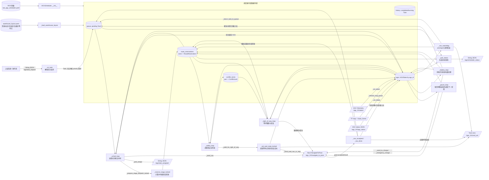
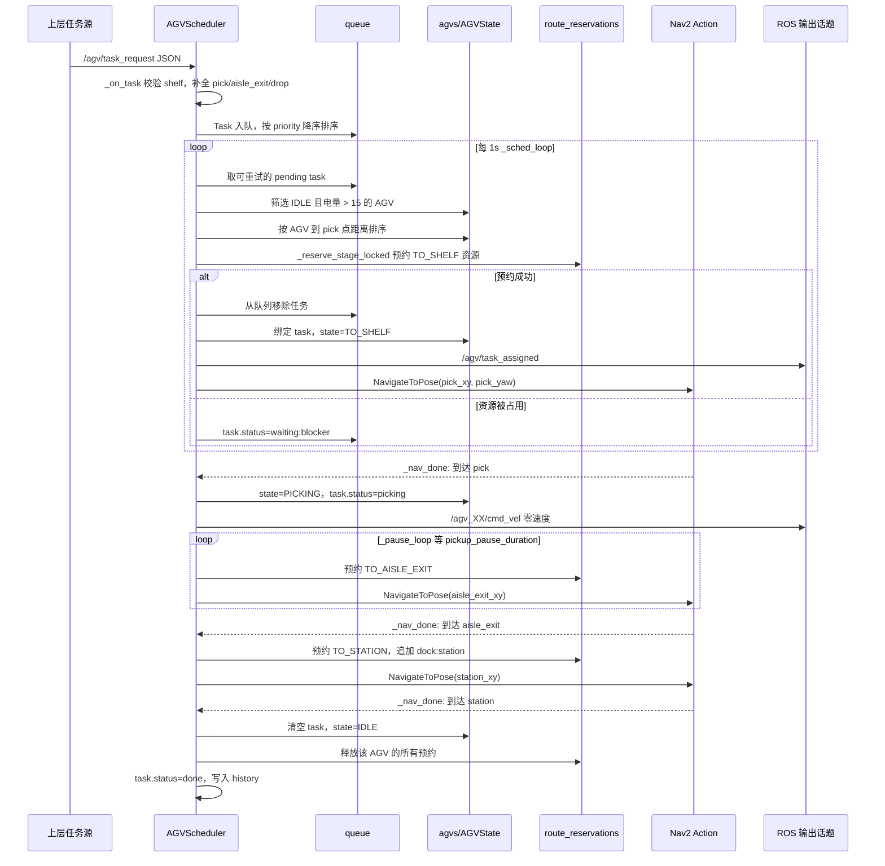
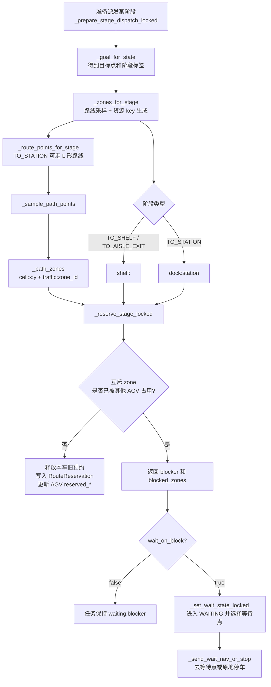
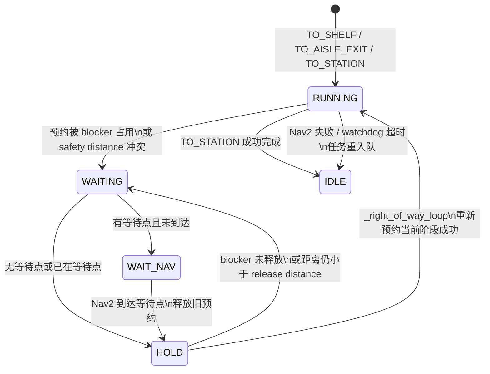
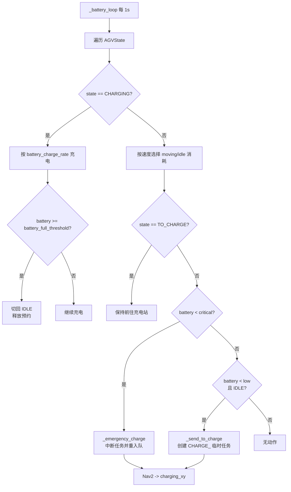

# AGV 调度器代码分析与数据流图

本文基于 `agv_scheduler/scheduler_node.py` 分析调度器的数据入口、内部数据存储、周期性处理流程、Nav2 交互和状态输出。

## 1. 调度器定位

`AGVScheduler` 是一个 ROS 2 中央调度节点，负责把 `/agv/task_request` 中的上层任务请求转换为：

- 指定 AGV 的任务分配消息；
- 分阶段的交通资源预约；
- Nav2 `NavigateToPose` action goal；
- 安全让行、等待点停靠和恢复调度；
- 电量消耗、低电量返航充电和紧急中断充电；
- `/agv/scheduler_status` 运行状态快照。

核心状态对象包括：

| 数据结构 | 作用 |
| --- | --- |
| `Task` | 任务实体，包含货架、取货点、通道出口、投递点、优先级、指定车辆、重试时间和错误信息。 |
| `AGVState` | 单车运行态，包含 pose、电量、状态机、当前任务、Nav2 goal、等待/恢复信息和预约资源。 |
| `RouteReservation` | 以 cell、货架、dock、traffic zone 为 key 的阶段式互斥资源预约。 |
| `ConflictLock` | 近距离冲突中的 winner/loser 锁，避免两车反复互让。 |
| `TrafficZone` / `WaitPoint` | 仓库交通区和安全等待点配置。 |

## 2. 顶层数据流图

## 3. 任务主流程数据流

## 4. 阶段式预约与冲突控制

资源 key 的来源：

| key 类型 | 生成位置 | 用途 |
| --- | --- | --- |
| `cell:<gx>:<gy>` | 对阶段路线采样后按 `route_cell_size` 栅格化 | 通用路径互斥。 |
| `traffic:<zone_id>` | 采样点落入 `warehouse_layout.yaml` 的 `traffic_zones` 多边形 | 主通道、站台车道等交通区控制。 |
| `shelf:<id>` | `TO_SHELF` 和 `TO_AISLE_EXIT` 阶段追加 | 保护货架取货/离开区域。 |
| `dock:station` | `TO_STATION` 阶段追加 | 保护出货站台。 |

## 5. 让行、等待和恢复数据流

关键数据变化：

1. `_safety_loop` 发现两车距离小于 `safety_stop_distance` 后，为 pair 写入 `ConflictLock`，固定 winner/loser。
2. loser 通过 `_yield_for_right_of_way` 取消当前 Nav2 goal，并把当前阶段目标保存到 `resume_goal_xy` / `resume_goal_yaw`。
3. `_set_wait_state_locked` 将 AGV 切到 `WAITING`，写入 `wait_reason`、`wait_zone`、`yielding_to`、`wait_point_xy`。
4. `_send_wait_nav_or_stop` 将车辆导航到安全等待点；若没有等待点，则发布零速度原地等待。
5. `_right_of_way_loop` 在 hold 时间结束、距离满足 `right_of_way_release_distance` 且重新预约成功后，恢复原阶段 Nav2 goal。

## 6. 电量与充电数据流

## 7. 输出状态快照

`_pub_status` 每 0.5 秒发布一次 `/agv/scheduler_status`，其 JSON 主要包含：

- `pending` / `completed`：队列和已完成任务计数；
- `queue`：待执行任务、指定车辆、重试剩余时间、最近错误；
- `reservations`：每个预约 zone 当前归属 AGV、任务、阶段和过期时间；
- `traffic_zones`：交通区类型和等待点；
- `fleet`：每台 AGV 的状态、位置、pose 来源、电量、速度、任务、当前目标、等待/让行信息和已预约资源。

这使外部监控可以从单个话题复原“任务队列 -> 车辆状态 -> 交通预约 -> Nav2 目标”的完整调度上下文。
